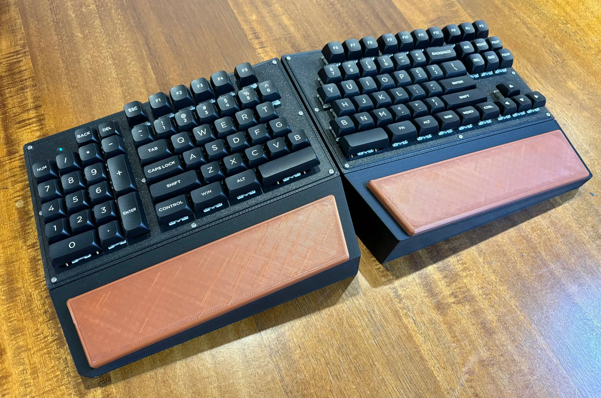

# ksn1-firmware

ZMK firmware for the KSN-1 split keyboard — the original design that KSN-2 and the Nexplit Keypad are both derived from.

* Keyboard Maintainer: [AJG](https://github.com/Kesaros44)
* Hardware Supported: KSN-1 split keyboard, nice!nano v2 (nRF52840), BLE



## Hardware

- **MCU:** nice!nano v2 (nRF52840) per half, wireless (BLE)
- **Central:** right half
- **Matrix:** 6 rows × 22 columns combined (11 per half), `col2row`
- **Encoder:** one EC11 encoder, right half only
- **LEDs (left half only):** Caps Lock LED, BLE connection-status LED
- **Backlight:** designed into the schematic, but parts aren't populated and the feature is disabled in firmware (`CONFIG_ZMK_BACKLIGHT=n`) — no backlight on the physical board
- **RGB underglow:** none
- **Battery:** reported from both halves

## Keymap (`config/ksn_1.keymap`)

Three layers:

- **`default_layer`** — Windows base layer with an integrated numpad on the left. Encoder = volume. Numpad corner key runs a macro (Win+R → `calc` → Enter) to launch the calculator.
- **`func_layer`** (hold `&mo 1`) — Bluetooth profile select (0–4) and clear, output toggle, backlight inc/dec on the encoder (no-op — no backlight hardware), toggle (`&tog 2`) into `mac_layer`.
- **`mac_layer`** — same layout with Mac modifier order and Mac media/brightness keys; numpad corner key instead runs Cmd+Space → Spotlight calculator.

## Building

GitHub Actions builds on every push — grab the `.uf2` files (`ksn_1_left`, `ksn_1_right`, `settings_reset`) from the workflow run's artifacts.

Local build with `west`:

```sh
west init -l config
west update
west build -p -b nice_nano_v2 -- -DSHIELD=ksn_1_left -DZMK_EXTRA_MODULES=$(pwd)/config
west build -p -b nice_nano_v2 -- -DSHIELD=ksn_1_right -DZMK_EXTRA_MODULES=$(pwd)/config
```

## Flashing

Double-tap reset on the nice!nano to enter the UF2 bootloader, then drag the matching `.uf2` onto the `NICENANO` drive (left firmware → left half, right → right half). Flash both halves — they run different images.

## Re-pairing / clearing Bluetooth bonds

Flash the `settings_reset` artifact to a half to wipe its BLE bonds, then reflash normal firmware and re-pair.

---

# ksn1-firmware (한국어)

KSN-1 스플릿 키보드용 ZMK 펌웨어 설정입니다 — KSN-2와 Nexplit Keypad가 파생된 원조 설계입니다.

* 키보드 관리자: [AJG](https://github.com/Kesaros44)
* 지원 하드웨어: KSN-1 스플릿 키보드, nice!nano v2 (nRF52840), BLE

## 하드웨어

- **MCU:** half마다 nice!nano v2 (nRF52840), 무선(BLE)
- **Central:** 오른쪽 half
- **매트릭스:** 6행 × 22열 (half당 11열), `col2row`
- **인코더:** EC11 인코더 1개, 오른쪽 half에만 있음
- **LED (왼쪽 half 전용):** Caps Lock LED, BLE 연결상태 LED
- **백라이트:** 회로도에는 설계되어 있지만 부품이 실장되지 않았고 펌웨어 기능도 꺼져 있음(`CONFIG_ZMK_BACKLIGHT=n`) — 실제 보드에는 백라이트 없음
- **RGB 언더글로우:** 없음
- **배터리:** 양쪽 half 모두 보고

## 키맵 (`config/ksn_1.keymap`)

3개 레이어:

- **`default_layer`** — 왼쪽에 넘버패드가 통합된 Windows 기본 레이어. 인코더 = 볼륨. 넘버패드 코너 키가 매크로(Win+R → `calc` → Enter)로 계산기 실행.
- **`func_layer`** (홀드 `&mo 1`) — 블루투스 프로필 선택(0–4) 및 clear, 출력 토글, 인코더로 백라이트 증감(백라이트 하드웨어 자체가 없어서 실제 동작은 없음), `mac_layer`로의 토글(`&tog 2`).
- **`mac_layer`** — 동일한 배열에 Mac 모디파이어 순서와 Mac 미디어/밝기 키; 넘버패드 코너 키는 대신 Cmd+Space → Spotlight 계산기 실행.

## 빌드

GitHub Actions가 push마다 자동으로 빌드합니다 — 워크플로우 실행의 아티팩트에서 `.uf2` 파일(`ksn_1_left`, `ksn_1_right`, `settings_reset`)을 받으면 됩니다.

`west`로 로컬 빌드:

```sh
west init -l config
west update
west build -p -b nice_nano_v2 -- -DSHIELD=ksn_1_left -DZMK_EXTRA_MODULES=$(pwd)/config
west build -p -b nice_nano_v2 -- -DSHIELD=ksn_1_right -DZMK_EXTRA_MODULES=$(pwd)/config
```

## 플래싱

nice!nano의 리셋 버튼을 더블탭해서 UF2 부트로더로 진입한 뒤, 마운트된 `NICENANO` 드라이브에 해당하는 `.uf2`(왼쪽 → 왼쪽 half, 오른쪽 → 오른쪽 half)를 드래그하면 됩니다. 양쪽 half 모두 플래시해야 합니다 — 서로 다른 이미지를 사용합니다.

## 재페어링 / 블루투스 본딩 초기화

`settings_reset` artifact를 해당 half에 플래시하면 BLE 본딩이 초기화됩니다. 그 다음 정상 펌웨어를 다시 플래시하고 재페어링하세요.
